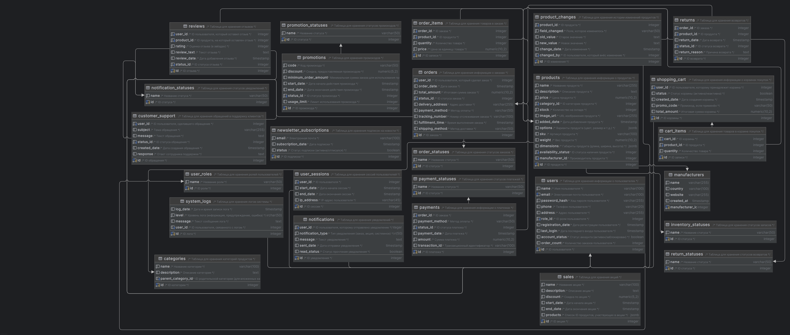
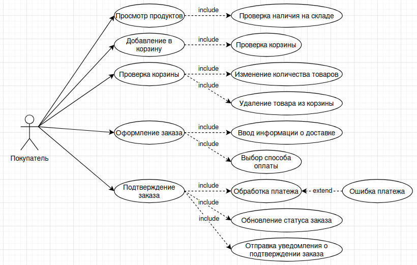
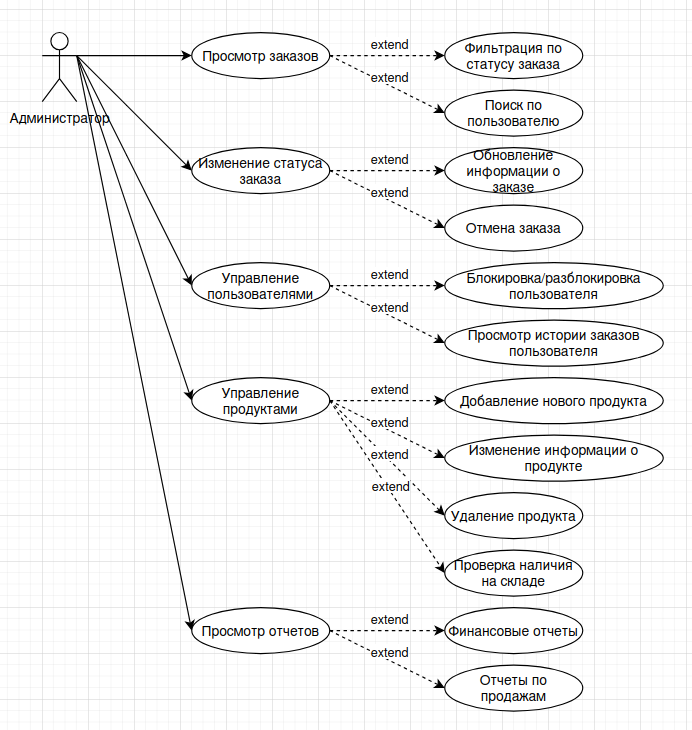

# WeMarketOnGolang

Студент группы ЭФМО-02-24: Васнев Илья Павлович

### Практическая работа 1
Тема работы: интернет-магазин

#### Users (Пользователи)
Содержит: ID пользователя; Имя; Электронная почта; Пароль (в хэшированном виде); Телефон; Адрес доставки; Роль;
Дата регистрации; Дата последнего входа; Статус аккаунта; Количество заказов.

#### Products (Продукты)
Содержит: ID продукта; Название; Описание; Цена; Категория; Количество на складе; Изображение продукта; Дата добавления; 
Варианты; Производитель; SKU; Вес продукта; Габариты; Статус наличия.

#### Categories (Категории)
Содержит: ID категории; Название категории; Описание категории; Родительская категория.

#### Shopping Cart (Корзина покупок)
Содержит: ID корзины; ID пользователя; Статус; Дата создания; Промокод; Итоговая сумма.

#### Cart Items (Товары в корзине)
Содержит: ID записи; ID корзины; ID продукта; Количество; Цена на момент добавления.

#### Orders (Заказы)
Содержит: ID заказа; ID пользователя; Дата заказа; Итоговая сумма; Статус заказа; Адрес доставки; Способ оплаты; 
Номер отслеживания; Время выполнения заказа; Способ доставки.

#### Order Items (Товары в заказе)
Содержит: ID записи; ID заказа; ID продукта; Количество; Цена за единицу.

#### Reviews (Отзывы)
Содержит: ID отзыва; ID пользователя; ID продукта; Оценка; Текст отзыва; Дата добавления; Статус отзыва.

#### Payments (Платежи)
Содержит: ID платежа; ID заказа; Способ оплаты; Статус платежа; Дата платежа; Сумма; Транзакционный идентификатор.

#### Inventory (Склад)
Содержит: ID продукта; Количество на складе; Местоположение склада; Статус запасов.

#### Suppliers (Поставщики)
Содержит: ID поставщика; Название компании; Контактное лицо; Телефон; Электронная почта; Адрес; Статус сотрудничества.

#### Shipping (Доставка)
Содержит: ID доставки; ID заказа; Способ доставки; Стоимость доставки; Срок доставки; Номер отслеживания; Текущий статус.

#### Returns (Возвраты)
Содержит: ID возврата; ID заказа; ID продукта; Дата возврата; Статус возврата; Причина возврата.

#### Promotions (Промокоды)
Содержит: ID промокода; Код; Скидка; Минимальная сумма заказа; Дата начала действия; Дата окончания действия; 
Статус промокода; Лимит использования.

#### User Sessions (Сессии пользователей)
Содержит: ID сессии; ID пользователя; Дата начала; Дата окончания; IP-адрес.

#### Notifications (Уведомления)
Содержит: ID уведомления; ID пользователя; Тип уведомления; Текст уведомления; Дата отправки; Статус прочтения.

#### Sales (Акции)
Содержит: ID акции; Название; Описание; Скидка; Начало и конец акции; Продукты.

#### Customer Support (Поддержка клиентов)
Содержит: ID обращения; ID пользователя; Тема обращения; Текст сообщения; Статус; Дата создания обращения; Ответ сотрудника.

#### Product Changes (История изменений продуктов)
Содержит: ID изменения; ID продукта; Поле, которое изменилось; Старое значение; Новое значение; Дата изменения; 
Пользователь, который внёс изменение.

#### Newsletter Subscriptions (Подписка на новости)
Содержит: ID подписки; Электронная почта; Дата подписки; Статус подписки.

#### System Logs (Логи системы)
Содержит: ID лога; Дата и время; Уровень; Сообщение; Пользователь (если применимо).

### Практическая работа 2
Диаграмма вариантов использованияS
#### UseCase для пользователя

#### UseCase для администратора

