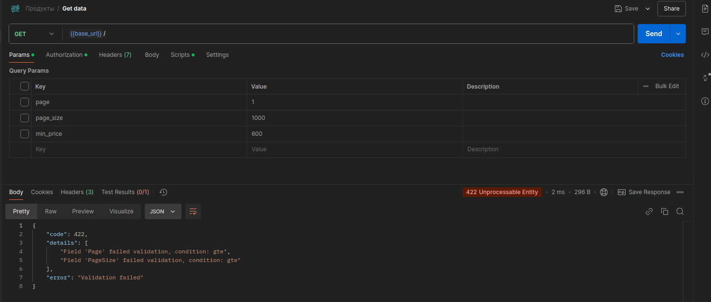
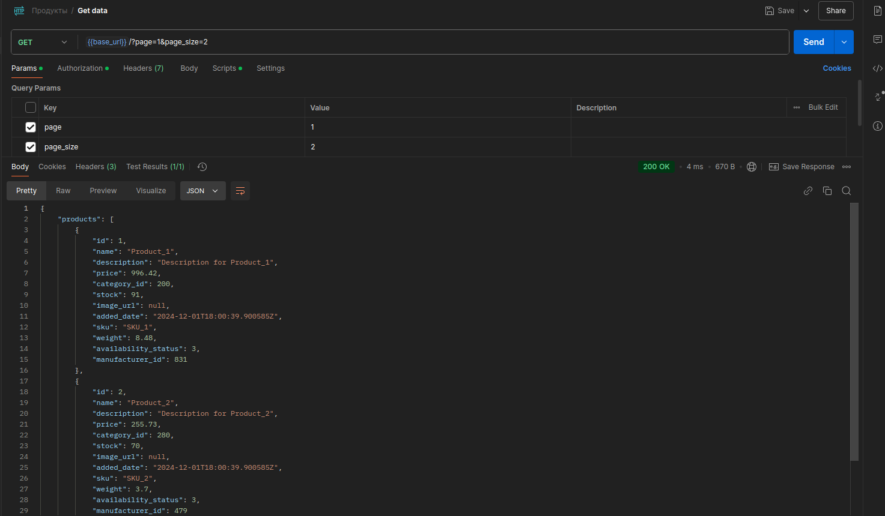
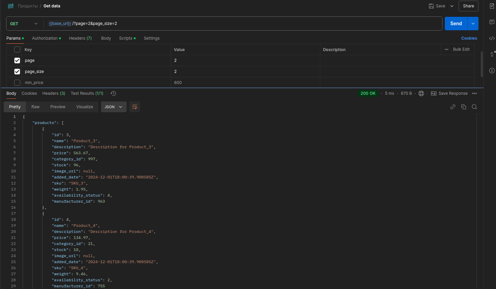
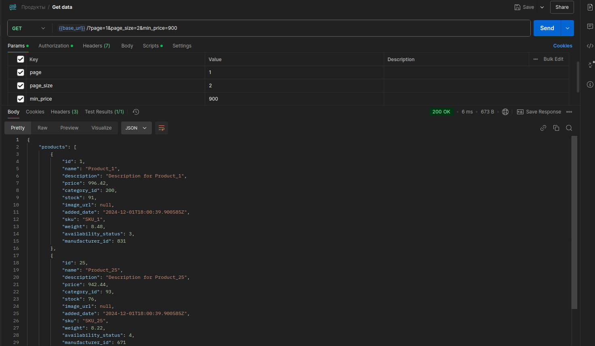
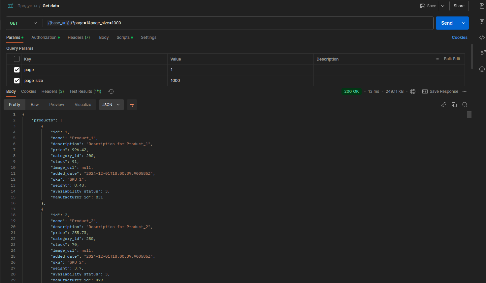
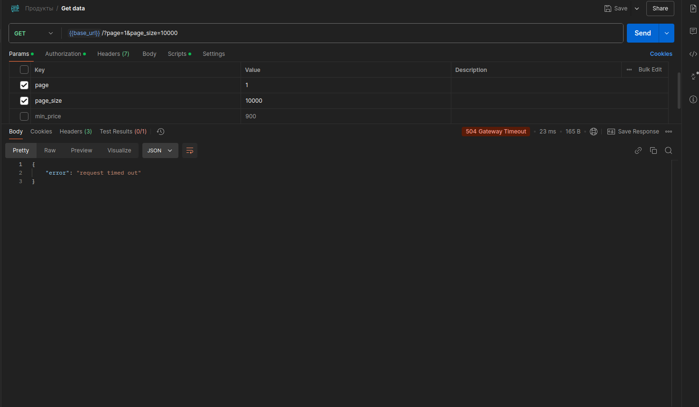

## Практическая работа 11

### Выполнил студент группы ЭФМО-02-24 Васнев Илья

### Обработка ошибки валидации

### Пагинация и фильтрация

# Первая страница

# Вторая страница

# Фильтрация по цене больше 900

### Таймаут при запросе больше 20мс

# Запрос 1000 строк за 13мс 

# Запрос 10000 строк за 23мс, выход по таймауту
